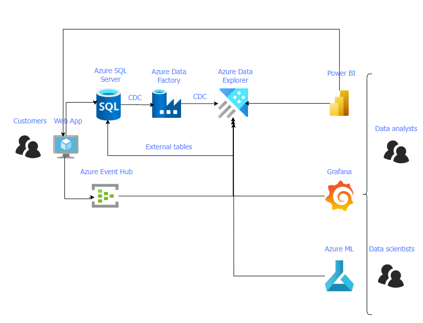
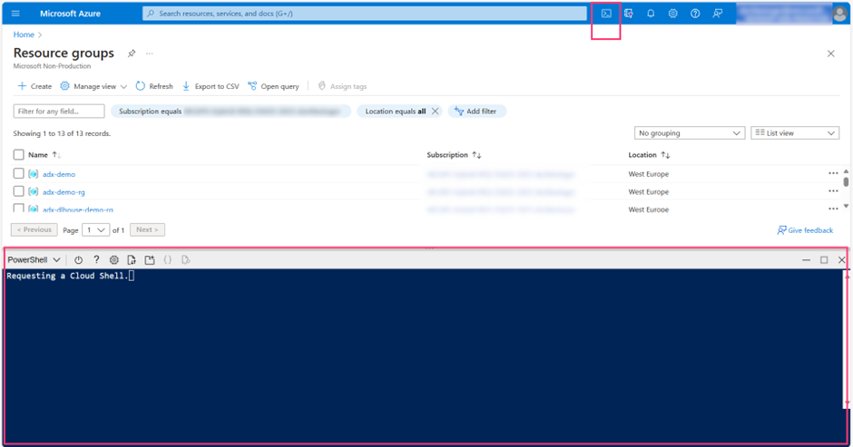

# Workshop - Building an Analytics platform using Azure Data Explorer (Kusto)
Created by: [Denise Schlesinger](https://www.linkedin.com/in/deniseschlesinger/)

# Introduction
Suppose you own an e-commerce website selling bike accessories.  
You have millions of visitors a month, you want to analyze the website traffic, consumer patterns and predict sales.  
This workshop will walk you through the process of building an end-to-end Data Analytics Solution for your e-commerce website.

You will learn how to:
* Build a star schema in Azure Data Explorer
* Build Data pipelines using Azure Data Factory for CDC (change data capture)
* Stream events into Azure Event hubs and ingest them into Azure Data Explorer
* Create data transformations in Azure Data Explorer 
* Use Notebooks to create product recommendations
* Create reports & Visualize the data using Power BI
* Create reports and Alerts connecting Grafana to Azure Data Explorer

## Workshop sections
[Introduction](#introduction)  
[Pre-requisites](#pre-requisites)  
[Build the infrastructure](#building-the-infrastructure)  
[Joining with external tables](#joining-with-external-tables)  
[Ingesting events into Azure Data Explorer from Event hub](#ingesting-events-into-azure-data-explorer-from-event-hub)  
[CDC using Azure Data Factory](#cdc-using-azure-data-factory)  
[Create synthetic events with orders](#create-synthetic-events-with-orders)  
[Visualization in Azure Data Explorer web UI](#visualization-in-azure-data-explorer-web-ui)  
[Visualization in PowerBI](#visualization-in-power-bi)  
[Visualization and alerts in Grafana](visualization-and-alerts-in-grafana)  
[Materialized views](#materialized-views)  
[ML in Azure Data Explorer](#ml-in-azure-data-explorer)  
[Monitoring](#monitoring)
[Additional information](#additional-information)

## Architecture

## Pre-requisites
* An Azure Account where you have admin permissions
* Python 3.7 running locally in your machine
* VsCode

# Building the infrastructure
## IMPORTANT!!!!! - Before running the scripts - CHANGE PREFIX and user Id
* Add your user Id in the [deployAll.bicep](<infrastructure scripts/deployAll.bicep>) file here to be the Grafana admin:
<blockquote>
@description('Specifies the object id of an Azure Active Directory user granted the Grafana Admin role')  

param userId string = '<grafana-admin-user-object-id>'
</blockquote>

* Option 1: You can get your userID  by running the following command from the cloud shell in the Azure Portal
<blockquote>
az ad signed-in-user show --query id -o tsv
</blockquote>

* Option 2:  by going in the Azure Portal to:  
Microsoft entra > Users
Search for your user and get the user Id as follows:  

## Run scripts to build all the Infrastructure
Run powershell scripts in the Azure portal Cloudshell

1. Go to the azure portal and login with a user that has administrator permissions
2. Open the cloud shell in the azure portal
3. Upload the file “all.zip” in the github repo by using the upload file button in the cloud shell
4. Unzip the file by writing unzip all.zip
5. Run ./createAll.ps1  

NOTE: This takes time so be patient !!

### The script above creates the following entities

# Joining with External tables
[Azure Data Explorer External tables](https://learn.microsoft.com/en-us/azure/data-explorer/kusto/query/schema-entities/external-tables)
An external table is a schema entity that references data stored external to a Kusto database in your cluster.

In this workshop we created an external table in Kusto.

The "products" table in Kusto is actually the Product table in our SQL server DB, which we created in the [KQL script](<infrastructure scripts/script.kql>)   we run after creating the Kusto cluster

<code style="color : white">
.create external table ...
</code>
 
 
  
***  EXERCISE - RUN THIS QUERIES IN AZURE DATA EXPLORER WEB UI***  

<code style="color : orange">
.create external table ...
</code>

# Ingesting events into Azure Data Explorer from Event hub
# CDC using Azure Data Factory
# Create synthetic events with orders
# Visualization in Azure Data Explorer web UI
# Visualization in PowerBI
# Visualization and alerts in Grafana
# Materialized views
# ML in Azure Data Explorer

# Monitoring 
Setup diagnostic logs  
https://learn.microsoft.com/en-us/azure/data-explorer/using-diagnostic-logs?tabs=ingestion

Create an Azure alert on FailedIngestion table   
https://learn.microsoft.com/en-us/azure/azure-monitor/alerts/tutorial-log-alert

# Additional Information

[How to configure an app registration to connect to Azure Data Explorer](https://learn.microsoft.com/en-us/azure/data-explorer/provision-entra-id-app)

Add AAD user from another tenant to access from PBI to ADX  
.add database ['storeDB'] admins ("aaduser=user@microsoft.com;your aad tenant id here")

Add AAD app to ADX as admin + run the following command inside ADX   
.add database ['your db name'] users ('aadapp=your app-id') 'Demo app put your comment here (AAD)'

[Jaccard Similarity](https://www.geeksforgeeks.org/how-to-calculate-jaccard-similarity-in-python/)
