# Introduction
Suppose you own an e-commerce website selling bike accessories.  
You have millions of visitors a month, you want to analyze the website traffic, consumer patterns and predict sales.  
This workshop will walk you through the process of building an end-to-end Data Analytics Solution for your e-commerce website.

You will learn how to:
* Build a star schema in Azure Data Explorer
* Build Data pipelines using Azure Data Factory for CDC (change data capture)
* Stream events into Azure Event hubs and ingest them into Azure Data Explorer
* Create data transformations in Azure Data Explorer 
* Create reports & Visualize the data using Azure Data explorer dashboards
* Create reports and Alerts connecting Grafana to Azure Data Explorer


At the end of this tutorial you will have created the following entities:  


All the code in this tutorial can be found here:   
[ADX Analytics github repo](<https://github.com/denisa-ms/adx-analytics/tree/main>)  


<div class="info" data-title="Note">  

> Azure ML notebooks are coming soon.  

</div>

---

# Architecture


---

# Azure Data Explorer features

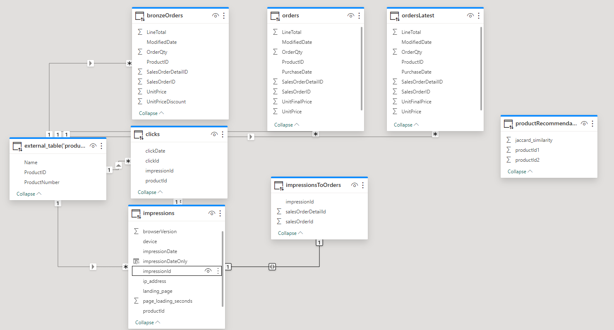

We are showcasing many of Azure Data Explorer capabilities:
* [External tables](https://learn.microsoft.com/en-us/azure/data-explorer/kusto/query/schema-entities/external-tables)   
  Products table: defined as an external table hosted in our operational SQL DB. 
  An external table is a schema entity that references data stored external to a Kusto database in your cluster.
* [Continuous Data Ingestion](<https://learn.microsoft.com/en-us/azure/data-explorer/ingest-data-overview#continuous-data-ingestion>)   
  Clicks and Impressions tables: are ingested from Azure Event Hub
* [CDC using Azure Data Factory](<https://learn.microsoft.com/en-us/azure/data-factory/tutorial-incremental-copy-overview>)  
  BronzeOrders: feed by Azure Data Factory using CDC (change data capture)
* [Update policies](<https://learn.microsoft.com/en-us/azure/data-explorer/kusto/management/update-policy>)    
  Orders: created on ingestion based on Kusto's update policies feature, that allows appending rows to a target table by applying transformations to a source table.
* [Materialized views](<https://learn.microsoft.com/en-us/azure/data-explorer/kusto/management/materialized-views/materialized-view-overview>)  
  OrdersLatest: materialized view - exposes an aggregation over a table or other materialized view
 
## KQL Commands 

You can review all the commands used to create external tables, update policies, materialized views and mappings for ingestion in the [KQL script](<https://github.com/denisa-ms/ADX-Analytics/blob/main/infrastructure%20scripts/script.kql>) file. 
This is the script we run in the deployment after creating the Kusto cluster.

---

# Pre-requisites
* An [Azure Subscription](<https://azure.microsoft.com/en-us/free/>) where you have admin permissions
* [Python 3.7+](<https://www.python.org/>) running locally in your machine
* [Visual Studio Code](<https://code.visualstudio.com/>)

---

# Variables setting before running the scripts
<div class="task" data-title="IMPORTANT - before running the scripts">

> * Change prefix to be unique in the [deployAll.bicep](<https://github.com/denisa-ms/ADX-Analytics/blob/main/infrastructure%20scripts/deployAll.bicep>) file  
```
   param prefix string = '<change this prefix>'
```
> * Change the name of the Azure Data Factory in the [ADF_pipeline2.json](<https://github.com/denisa-ms/ADX-Analytics/blob/main/infrastructure%20scripts/ADF_pipeline2.json>) file to match the prefix as follows:  

```
   {
    "$schema": "https://schema.management.azure.com/schemas/2019-04-01/deploymentTemplate.json#",
    "contentVersion": "1.0.0.0",
    "parameters": {
        "factoryName": {
            "type": "string",
            "defaultValue": "<your prefix here>-adf"
        },
        ...
    }
   }
```

> * Add your user Id in the [deployAll.bicep](<https://github.com/denisa-ms/ADX-Analytics/blob/main/infrastructure%20scripts/deployAll.bicep>) file here to be the Grafana admin:   
```
   param userId string = '<grafana-admin-user-object-id>'
```
> - Option 1: You can get your userID  by running the following command from the cloud shell in the Azure Portal   
>   az ad signed-in-user show --query id -o tsv
> - Option 2:  by going in the Azure Portal to:  
>   Microsoft entra > Users
>   Search for your user and get the user Id as follows: 
>     param userId string = '<grafana-admin-user-object-id>'
> 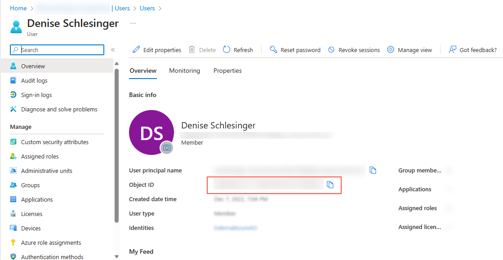

</div>

---

# Building the Infrastructure
Run powershell scripts in the Azure portal Cloudshell

1. Go to the azure portal and login with a user that has administrator permissions
2. Open the cloud shell in the azure portal
3. Upload the file “all.zip” in the github repo by using the upload file button in the cloud shell
4. Unzip the file by writing unzip all.zip
5. Run ./createAll.ps1  

<div class="info" data-title="Note">

> This takes time, so be patient 
</div>


---

# Post deployment tasks
## Define the event hub SAS (shared access policy) in [.env](https://github.com/denisa-ms/ADX-Analytics/blob/main/.env.template) file

<div class="task" data-title="Task">

> * Go to the Event hub -> Shared access policies  
> * Add  
> * Create a Policy called "adxdemo" with "Manage" privileges  
> * Save and copy the "Connection string–primary key"  
> * Paste into [.env](https://github.com/denisa-ms/ADX-Analytics/blob/main/.env.template) file the event hub connection string   
```
EVENT_HUB_CONN_STRING = "<event hub connection string>"   
```
</code>


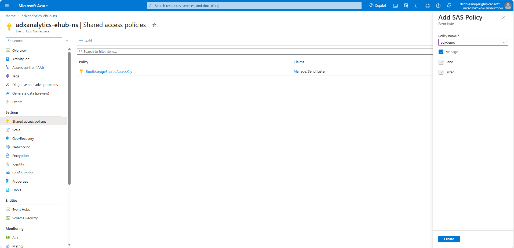


<br />

## Open Azure Data Studio and connect to our SQL DB
  

<div class="info" data-title="Note">

> Since we are using SQL serverless, this step is used to "awake" our SQL server
</div>

## Open Azure Data Factory to run the Change Data Capture
In this step we "stream" all the orders from the "SalesOrderDetail" table in SQL to Kusto

<div class="task" data-title="Task">

> Go to the Azure Data Factory in the Created Resource Group
> Launch the ADF Studio
> Author -> Pipelines -> "SQLToADX_orders"
> Click on "debug"
</div>


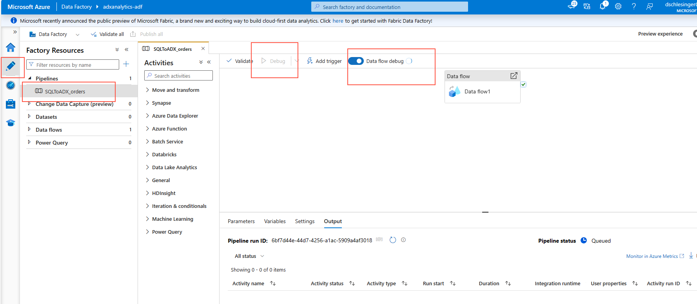
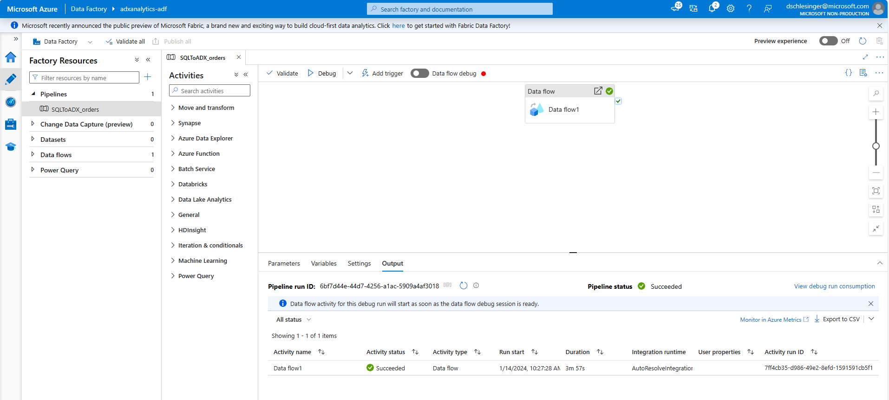

## Create synthetic events by running a Notebook
<div class="task" data-title="Task">

> * Follow the instructions in the [README file](https://github.com/denisa-ms/ADX-Analytics/blob/main/notebooks/README.md) located in the [notebooks](https://github.com/denisa-ms/ADX-Analytics/blob/main/notebooks) folder for creating a python virtual environment  
> * Run [Generate Synthetic events notebook](<https://github.com/denisa-ms/ADX-Analytics/blob/main/notebooks/Generate%20synthetic%20events%20.ipynb>)
</div>

## Generate updates on the SQL SalesOrderDetail table
<div class="task" data-title="Task">

> * If you did not create a python virtual environment yet, Follow the instructions in the [README file](notebooks/README.md) located in the [notebooks](https://github.com/denisa-ms/ADX-Analytics/blob/main/notebooks) folder for creating a python virtual environment  
> * Run [Generate orders updates notebook](<https://github.com/denisa-ms/ADX-Analytics/blob/main/notebooks/Generate%20orders%20updates.ipynb>)  
> * Run the CDC pipeline in Azure Data Factory to send the changes from SQL to Kusto (see [Open Azure Data Factory to run the Change Data Capture (CDC)](#open-azure-data-factory-to-run-the-change-data-capture) above  
</div>

---

# Read data in Kusto
Your Kusto DB should look like this:  
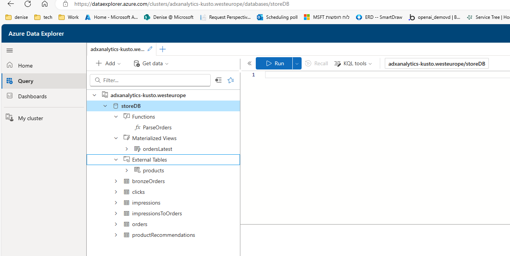
<br />

- Copy all KQL queries from the [exercise1.kql](https://github.com/denisa-ms/ADX-Analytics/blob/main/KQL/exercise1.kql) file to the Azure Data Explorer Web UI and run queries one by one.

<br />


<br />

---

# Visualization in Azure Data Explorer web UI
<div class="task" data-title="Important">

> If you changed the "prefix" param in the [deployAll.bicep](<https://github.com/denisa-ms/ADX-Analytics/blob/main/infrastructure%20scripts/deployAll.bicep>) file  
> You have to edit the [JSON defining the ADX WEB UI Dashboard data source](<https://github.com/denisa-ms/ADX-Analytics/blob/main/ADX%20dashboards/dashboard-Ecommerce%20dashboard.json>) as follows:  

```
    "dataSources": [
      {
        "id": "535ee10e-e104-4df6-a3eb-ac5cd7834691",
        "name": "storeDB",
        "scopeId": "kusto",
        "clusterUri": "https://prefix-kusto.westeurope.kusto.windows.net/",
        "database": "storeDB",
        "kind": "manual-kusto"
      }
    ],
```
<br />
</div> 

Import the dashboard as follows:
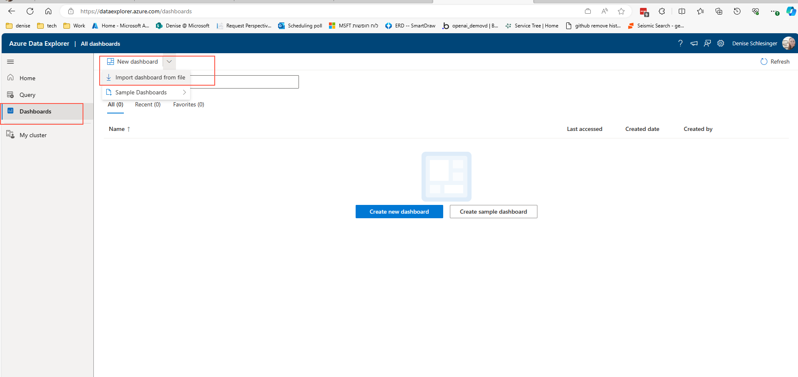

<br />

---

# Visualization and alerts in Grafana
Import the dashboard into Grafana as follows:

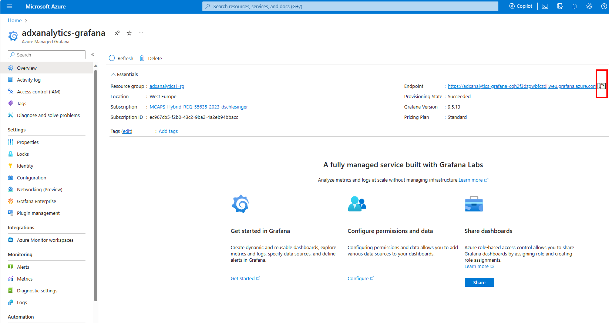
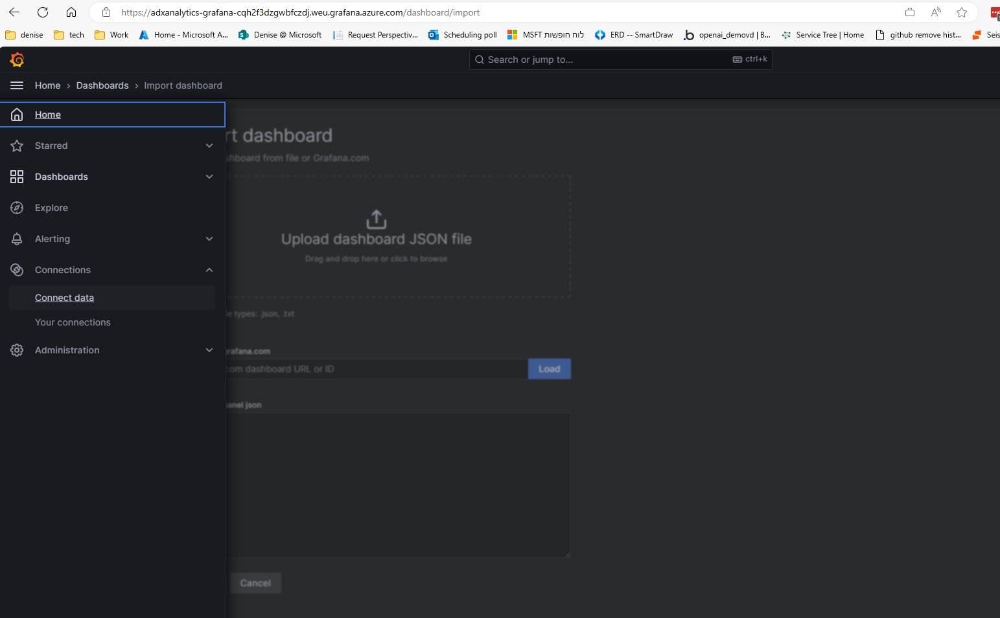


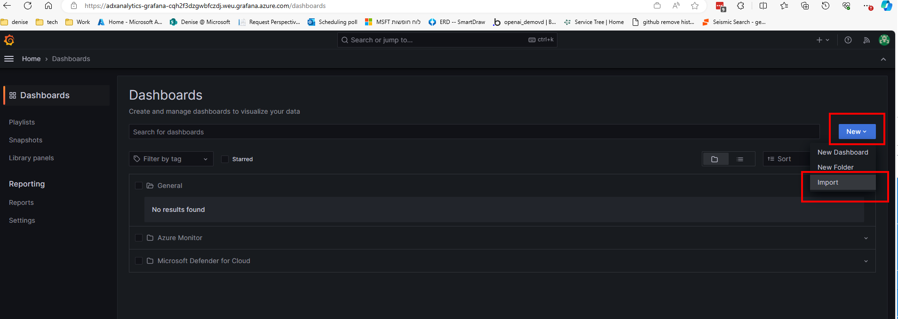


<br />

After creating the dashboards you can define alerts by following this tutorial  

---

# Visualization in Power BI

## Open the Power BI template provided in this demo to read from Azure Data Explorer

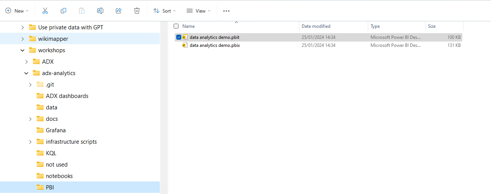
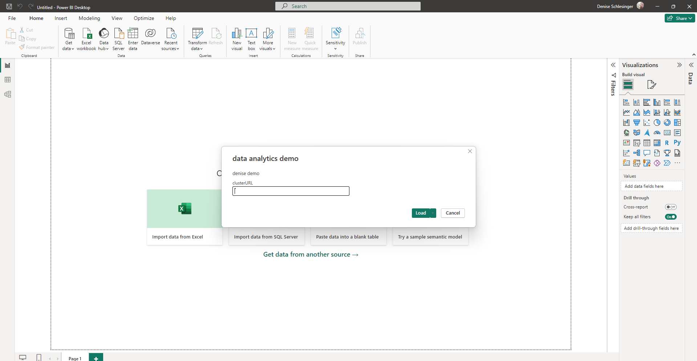
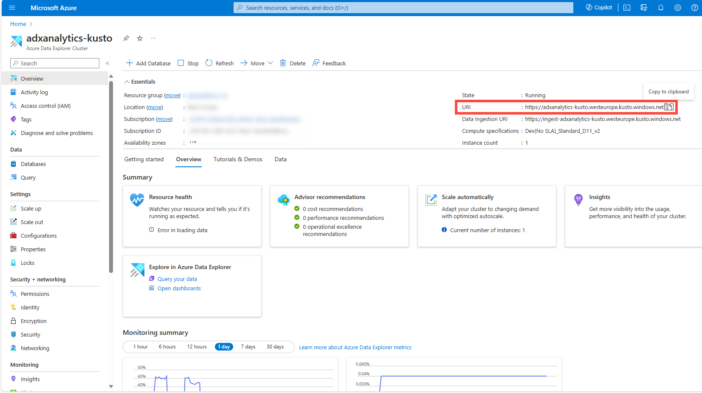

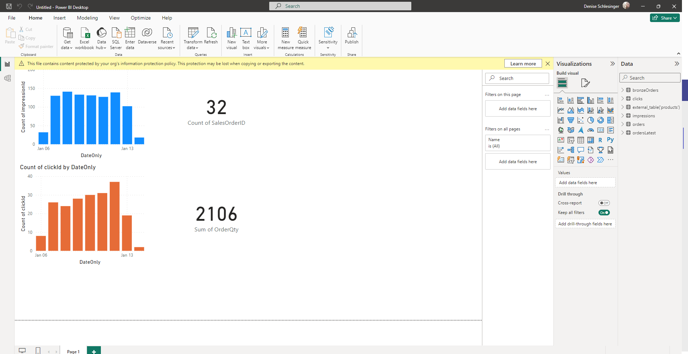

## Create a new Power BI report

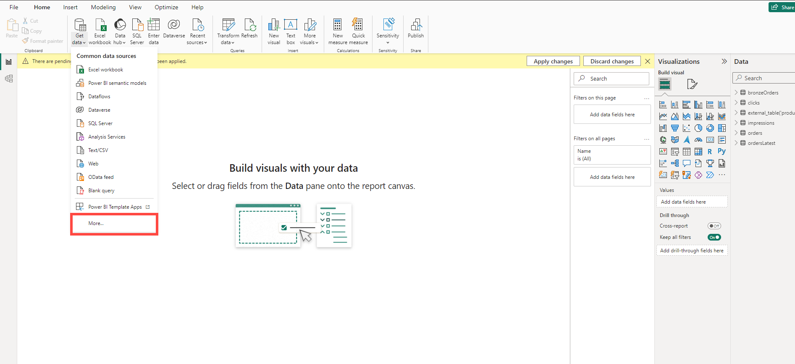
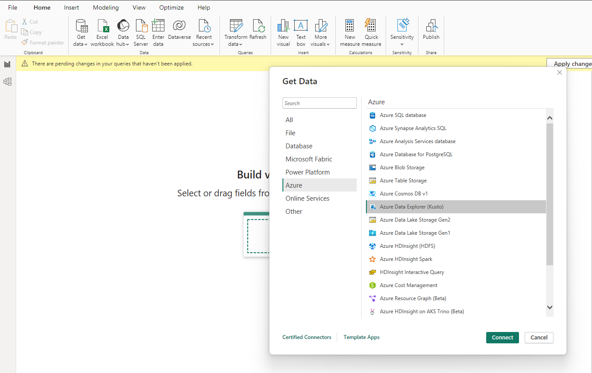


For more instructions:
[Use Azure Data Explorer data in Power BI](<https://learn.microsoft.com/en-us/azure/data-explorer/power-bi-data-connector?tabs=web-ui>)

---


# Additional Information

## Monitoring 
 Azure Monitor diagnostic logs provide data about the operation of Azure resources.  
 Azure Data Explorer uses diagnostic logs for insights on ingestion, commands, query, and tables.  
 You can export operation logs to Azure Storage, event hub, or Log Analytics to monitor ingestion, commands, and query status.  
 Logs from Azure Storage and Azure Event Hubs can be routed to a table in your Azure Data Explorer cluster for further analysis.

[Setup diagnostic logs](<https://learn.microsoft.com/en-us/azure/data-explorer/using-diagnostic-logs?tabs=ingestion>)  
[Create an Azure alert on FailedIngestion table](<https://learn.microsoft.com/en-us/azure/azure-monitor/alerts/tutorial-log-alert>)


## Connecting to Azure Data Explorer  
[How to configure an app registration to connect to Azure Data Explorer](https://learn.microsoft.com/en-us/azure/data-explorer/provision-entra-id-app)  

* Adding an AAD user from another tenant to access from PBI to ADX   
.add database ['storeDB'] admins ("aaduser=user@yourdomain.com;your aad tenant id here")  

* Adding an AAD app to ADX as admin + run the following command inside ADX    
.add database ['your db name'] users ('aadapp=your app-id') 'Demo app put your comment here (AAD)'   


